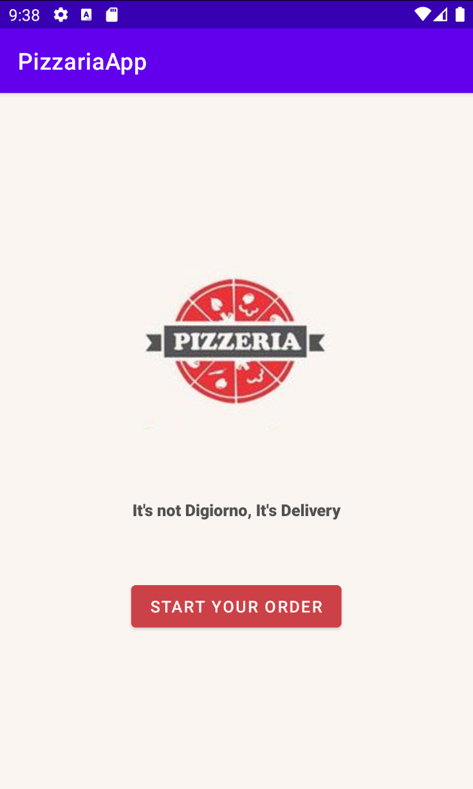
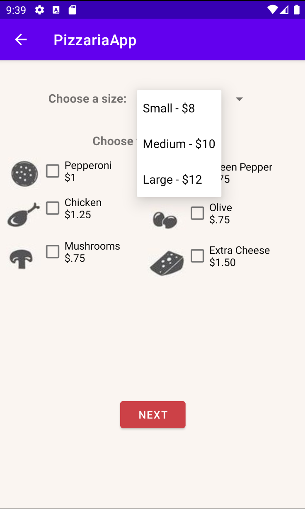
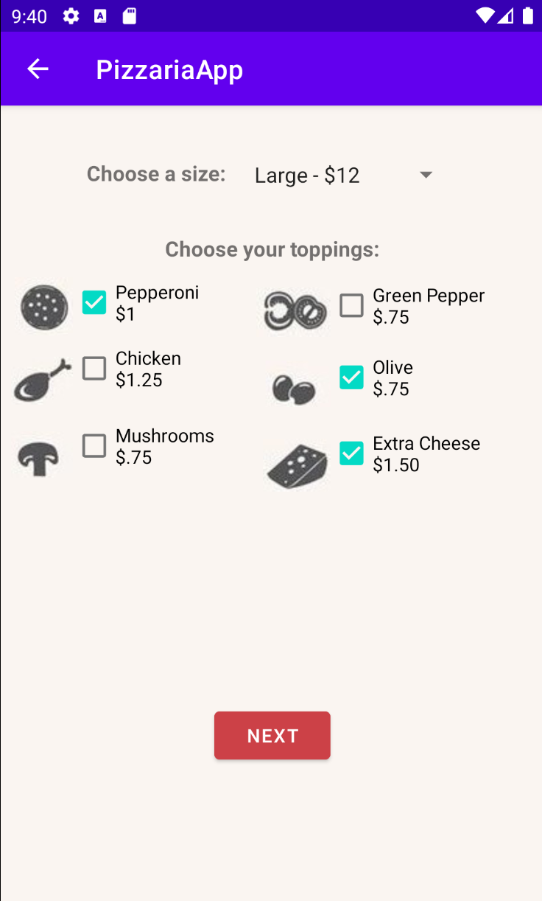
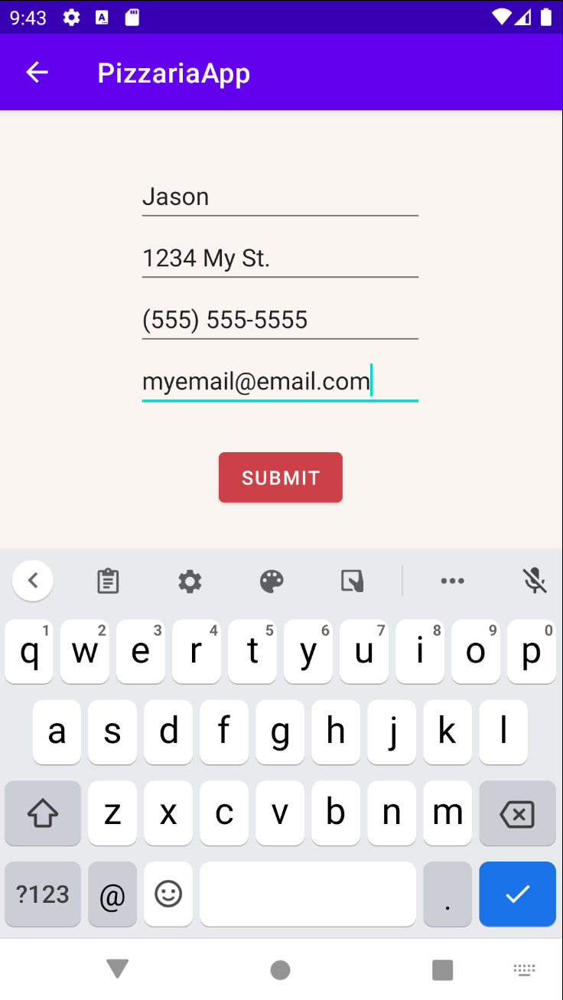
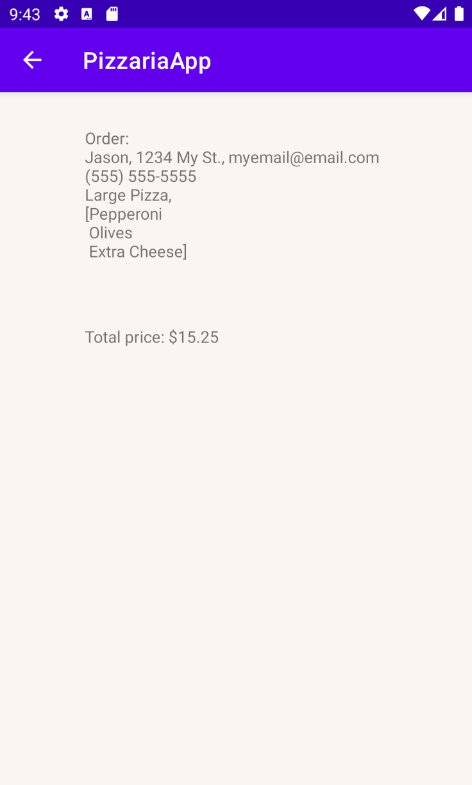

# Pizzaria
CIS4280 Programming Assignment 1

## About the App
This was a project towards the beginning of my Mobile Application Programming class at Cal Poly Pomona. We used Android Studio and coded in Java. It's a simple app that allows the user to choose the pizza size via a spinner and choose toppings via checkboxes.

||||
| ----- | ----- | ----- |

---
The user is then taken to another screen where they can input their information (name, address, phone, email) and click submit. A receipt is then displayed on the screen with user info and order total. 

|||
| ----- | ----- |

---
The main goal of the project was to save state changes when the screen is rotated as well as carry the data between views.
